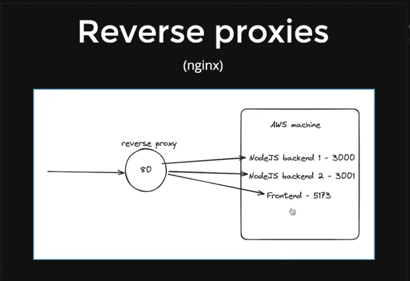

                                    ## Docker Notes ##

## Docker Containers:
- Docker containers are the **running instances** of docker images. 
- There can be multiple containers running from a single image.

- Containers >> Images >> Dockerfile >> Base Image (OS).

## Docker Images :
- Docker images are the **blueprints** of our application which form the basis of containers.
- for ex: ubuntu, node, nginx, redis, mongo, mysql, etc.

# Keywords : 
- -it : interactive tty (terminal) (container ke terminal me)

- *DOCKER COMMANDS* :
- docker run -it <image_name>
- docker start <container_name>
- docker stop <container_name>
- docker exec -it <container_name> bash
- docker exec <container_name> ls
- docker container ls (lists all the running containers) || docker ps
- docker container ls -a (lists all the containers)
- docker images (lists all the images locally)
- docker pull <image_name> (downloads the image from docker hub)

- *Docker Port Mapping* :
    (basically to map the port of the **image running in container** to the port of the **local machine**)
- docker run -it -p <port locally> : <port in container> <image_name> (-p stands for : port)

- *Docker Volume Mapping* :
    (basically to map the volume of the **image running in container** to the volume of the **local machine**)
- docker run -it -v <local_volume_path> : <container_volume_path> <image_name> (-v stands for : volume)

- *Passing Environment Variables* :
- docker run -it -e key=value -p 9000:9000 <image_name>

- -t (stands for "tag")

- *Docker Compose* :
- (agar tumhe multiple containers ko ek sath run karna hai toh docker-compose use karo)
- docker-compose up (basically to run the docker-compose.yml file) (docker-compose.yml file me saare containers ke configurations hote hai)
- docker-compose down (to stop the containers)
- docker-compose up -d (to run the containers in the background) (-d detached mode)
- docker-compose ps (to see the status of the containers)

- *Docker Push* :
- to push the image to the docker hub.
- docker logout
- docker login
- docker tag <image_name> <docker_hub_username>/<image_name>
- docker push <docker_hub_username>/<image_name>
- docker pull <docker_hub_username>/<image_name>

## kubectl and minikube :
- kubectl : kubernetes command line tool
- minikube : local kubernetes cluster

- basically kubernetes ko chalane ke liye hume ek cluster (minikube) chahiye hota hai. or vo cluster hum local machine pe bhi bana sakte hai using minikube. or ye kubernetes ek container me install hota hai using docker.

- *kubectl and Minikube Commands* :
- minikube start (to start the minikube cluster)
- minikube status (to check the status of the minikube cluster)
- minikube stop (to stop the minikube cluster)

- kubectl config current-context (to check the current context of kubectl)
- kubectl config get-contexts (to get the list of all the running contexts)
- kubectl config use-context <context_name>(minikube) (to switch the context)
- kubectl get nodes (to get the list of nodes)
- kubectl get pods (to get the list of pods)
- kubectl delete pod <pod_name> (to delete the pod)
- kubectl describe pod <pod_name> (to get the details of that particular pod)
- kubectl get services (to get the list of services)
- kubectl get services <service_name> (to get the list of that particular service)
- kubectl describe service <service_name> (to get the details of that particular service)
- kubectl apply -f <file_name> (to apply the configuration file)

## Please do follow these commands to push Docker Image to Artifact Registry --> 
    - video : https://www.youtube.com/watch?v=bk3LjHHWyyA

docker build -t 

gcloud services enable artifactregistry.googleapis.com
gcloud artifacts repositories create {repo-name} --repository-format=docker --location=us-central1 --description="created repo"
gcloud auth configure-docker us-central1-docker.pkg.dev

docker tag {local-image-name} us-central1-docker.pkg.dev/{project-name}/{repo-name}/{gcp-image-name}
docker push us-central1-docker.pkg.dev/{project-name}/{repo-name}/{gcp-image-name}

*Harkirat video 9.2*
## Deploying Backend on AWS (EC2) :

- *Steps* :
- Create an EC2 instance. 
- Add a name to the instance. 
- choose the OS. 
- choose Instance Type. 
- Add Key pair login and download the certificate. 
- Create Security Group.  
- configure security group and add inbound rules. (Now we need to open the following ports of that VM/Instance) : 22 (Used for ssh protocol), 80 (for localhost or http connections), 443 (for https connections), 5000 (Port at which your application is running).
- we need to open both IPv4 and IPv6 connections to these ports.
- Now launch the instance.
- Now connect to the instance using ssh.
- Go to your local machine terminal where the certificate is downloaded and run the following command : 
    - ssh -i "your-key.pem" ubuntu@your-machine-public-ip-domain.com
- Now you are connected to the instance.
- now clone your repository in the instance. using the following command : 
    - git clone <repository-url>
- Now install the dependencies of the project.
- Now run the application.
- Now to keep the application running even if you close the terminal , we need to instll PM2.
- To install PM2, run the following command : 
    - npm install pm2 -g
- Now cd into the project directory and run the following command : 
    - pm2 start app.js
    - pm2 status
    - pm2 kill
    - pm2 logs
- Now you can access the application using the public ip of the instance.

## Github Actions || CI/CD :
- Github Actions are used to automate the workflow of the project. 
- these are yaml files that are stored in the .github/workflows directory.
- these files contain the steps that are to be executed when a particular event occurs.
- ex:- let say whenever a commit is pushed to the main branch of our directory. we want the changes to occur in the EC2 instance. so we can write a github action for   that.

## Poiniting Domain to EC2 Instance's Public IP :
- first buy a domain from google domains or namecheap.
- now go to the domain settings and add the public ip of the EC2 instance in the A record of the domain.
- now you can access the application using the domain name.

## Reverse Proxy :
- Reverse Proxy is used to route the incoming requests to the appropriate server.
- for ex:- let say we have multiple servers running on the same machine. and we want to route the requests to the appropriate server based on the domain name. we can use reverse proxy for that.
- 
- frontend.krish.social.com -> frontend server running on port 3000
- backend.krish.social.com -> backend server running on port 5000 
- for this we can use Nginx as a reverse proxy server.
- Nginx sits on port 80 and routes the requests to the appropriate server based on the domain name using the nginx.conf file.

- Go to the EC2 instance and install Nginx using the following command : 
    - sudo apt-get update
    - sudo apt-get install nginx
- Now start the Nginx server using the following command :
    - sudo systemctl start nginx
- Now go to the /etc/nginx/nginx.conf file and remove the prewritten code and write your own code.
- Now add the following code to the file : 
    - http {
        server {
            listen 80;
            server_name backend.krish.social.com;
            location / {
                proxy_pass http://localhost:5000;
            }
        }
    }
- Now restart the Nginx server using the following command :
    - sudo nginx -s reload
- Now you can access the backend server using the domain name.

- Now restart the Nginx server using the following command : 
    - sudo systemctl restart nginx 
- Now you can access the frontend server using the domain name.

- or if you cant remember the nginx watch piyush garg nginx video. (https://www.youtube.com/watch?v=ofBFl4M4BFk)

## SSL Certificate :
- piyush garg video : https://www.youtube.com/watch?v=ofBFl4M4BFk