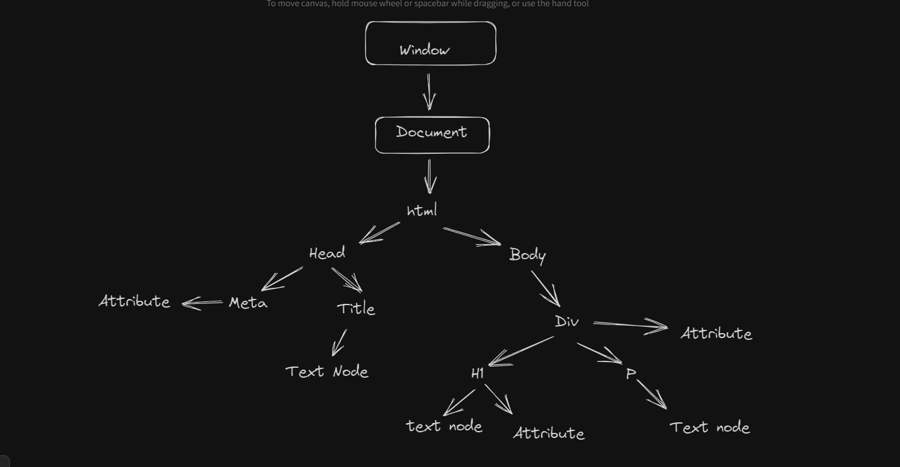

## How DOM Works ?
-
- Window >>> Document >>> HTML >>> Head & Body >>> Textnode attributes etc.

- Methods --->
1). .getElementById('id-name') --> returns an element with the specified id.

2). .getAttribute('id') or .getAttribute('class') --> returns the name of the id or class.
for example:- document.getElementById('title').getAttribute('class') --> will return 'heading'.

3). .setAttribute('id', 'id-name') or .setAttribute('class', 'class-name') 
NOTE:- setAttribute always overwites the existing attribute first. 
for example:- document.getElementById('title').setAttribute('class' , 'test')  --> will set a new class named 'test'. 

4). .style is used for styling.
for example :-
const title = document.getElementById('title')
title.style.display = 'none' or
title.style.color = '#0000'

5). .innerText and .textContent will get you the same value but , .textContent will also give the values that are hidden.

6). .querySelector() and .querySelectorAll() selects the element or class or id specified. 
    --> .querySelector('h1') or .querySelector('#title') or .querySelector('.head2')

