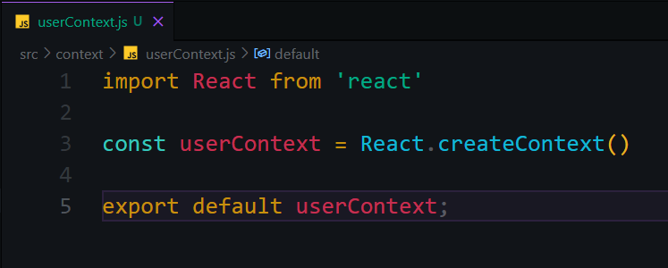
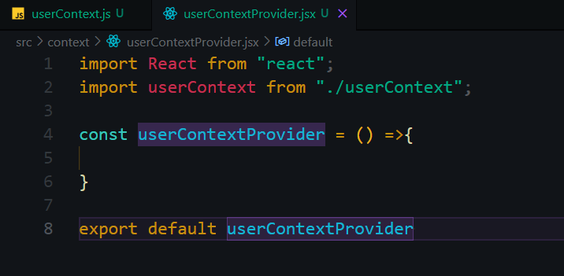
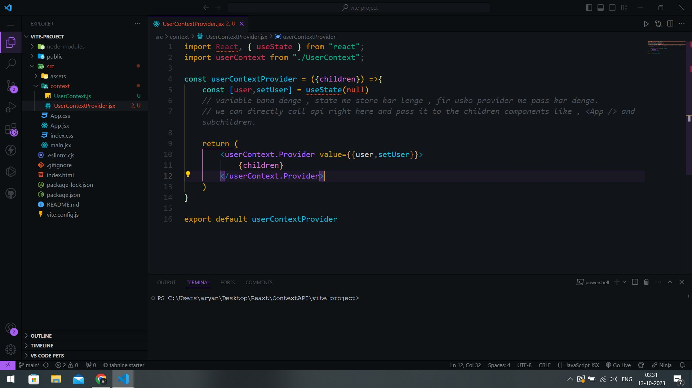

## State Management Tool :-
-React's Inbuilt.

## How to use :-
1). Set up your react application, make a folder named 'Context' in the src directory.
2). Create a file like 'UserContext.js'. BUT IN 'JS' FORMAT.
3). Obv we are studying context management so we need to create the context from react and then export that context too. here's how. 
-
(**Note** : Every Context comes with a provider function too to provide the context to every component.)
4). Now make a provider for the userContext BUT IN 'JSX' FORMAT. i.e,-> useContextProvider.jsx (bcz it returs some jsx inside it.)
5). Same thing as step three.  (just pass children to the userContextProvider function.)
6). Now its a jsx , so we need to return something. So we return everything that we passed as props into the userContext.provider, i.e. -> {children}
7). We also need to add this parameter 'Value' to the <>userContextProvider> to send the values.
- 
8). Now go to the App.jsx and wrap up the app with userContextProvider.
